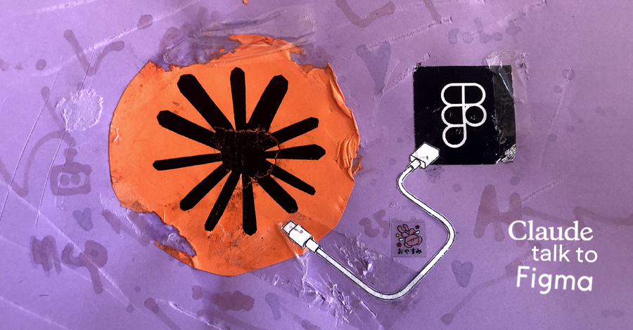

# <del>Claude</del> <ins>AI Agents</ins> Talk to Figma MCP

Enable your AI agents to read, analyze, and modify Figma designs.

Works with your favorite agentic tools:

- [Claude Desktop](https://claude.ai/)
- [Claude Code](https://docs.anthropic.com/en/docs/claude-code)
- [Cursor](https://cursor.com/)
- [Antigravity](https://antigravity.google/)
- [Windsurf](https://windsurf.com/)
- [VS Code](https://code.visualstudio.com/) + [GitHub Copilot](https://github.com/features/copilot)
- [Cline](https://marketplace.visualstudio.com/items?itemName=saoudrizwan.claude-dev)
- [Roo Code](https://marketplace.visualstudio.com/items?itemName=RooVeterinaryInc.roo-cline)

## 👩🏽‍💻 Who it's for

### UX/UI Teams

Automate repetitive design tasks and maintain brand consistency without manual effort:

- **Automated accessibility audits** - Detect and fix contrast issues in seconds
- **Bulk style updates** - Change colors, typography, or spacing across the entire document with a single command
- **Visual hierarchy analysis** - Get instant feedback on your design structure
- **Comment triage** - Read every review thread you're involved in and reply in bulk, without leaving the chat

### Developers

Generate production-ready code directly from designs:

- **React/Vue/SwiftUI components** - From design to code in one step
- **Code with design tokens** - Keep design and development in sync
- **Reduce handoff friction** - Fewer back-and-forth iterations with the design team

> **Key advantage**: Unlike [Figma's official MCP](https://www.figma.com/mcp-catalog/) which requires a Dev Mode license, this MCP **works with any Figma account** (even free ones).

> **Comments included**: Figma's Plugin API cannot see comments at all — they only exist in the REST API. This MCP bridges both, so your agent can read and reply to review threads as well as edit the canvas. See [Comment tools](#-comment-tools).

## 💡 Real-world use cases

**Accessibility:**
> "Find all text with contrast ratio <4.5:1 and suggest colors that meet WCAG AA"

**Rebranding:**
> "Change #FF6B6B to #E63946 in all primary buttons throughout the document"

**Design analysis:**
> "Analyze the visual hierarchy of this screen and suggest improvements based on design principles"

**Developer handoff:**
> "Generate the React component for 'CardProduct' including PropTypes and styles in CSS modules"

**Review triage:**
> "Show me every unresolved comment I'm involved in across the team, flag the ones waiting on my reply, and draft an answer for each"

---

# 🚀 Installation — complete beginner's guide

**Time needed:** ~15 minutes the first time. About 20 seconds every day after that.

This guide assumes **zero prior experience**. Every command is written out in full. If you have never opened a terminal before, that's fine — start at [Step 0](#step-0-open-the-terminal).

> 💡 Written for **macOS**. Windows differences are called out in `🪟 Windows` notes under each step.

## 🧠 First, understand what you're installing

This is not a single app. It's **three pieces that talk to each other**. Knowing this makes every later step (and every error message) make sense.

```
┌─────────────────┐        ┌──────────────────┐        ┌─────────────────┐
│  Claude Desktop │◄──────►│  WebSocket server│◄──────►│  Figma Desktop  │
│                 │  MCP   │  (localhost:3055)│   WS   │  + this plugin  │
│  1. Extension   │        │  2. Terminal     │        │  3. Plugin      │
└─────────────────┘        └──────────────────┘        └─────────────────┘
```

| # | Piece | What it does | Where it lives |
|---|-------|--------------|----------------|
| **1** | **The extension** (`.mcpb`) | Gives Claude the ~120 Figma tools | Installed inside Claude Desktop |
| **2** | **The WebSocket server** | The bridge/messenger between Claude and Figma | Runs in a Terminal window you keep open |
| **3** | **The Figma plugin** | Receives commands and actually edits your canvas | Installed inside Figma Desktop |

**All three must be running at the same time.** If any one is missing, Claude will say it can't reach Figma. That's the single most common problem people hit — see [Troubleshooting](#-troubleshooting-common-errors).

---

## Step 0: Open the Terminal

You'll need it for a few copy-paste commands. You do **not** need to understand them.

1. Press `Cmd` + `Space`
2. Type `Terminal`
3. Press `Enter`

A window with white or black text appears. That's the terminal. To run a command: copy it, paste it (`Cmd` + `V`), press `Enter`, and **wait** until the text stops scrolling and you get a fresh prompt line back.

> 🪟 **Windows:** press `Win`, type `PowerShell`, press `Enter`.

---

## Step 1: Install the four prerequisites

### 1a. Node.js

Check whether you already have it — paste this and press Enter:

```bash
node -v
```

- ✅ You see something like `v22.14.0` (any number **18 or higher**) → skip to 1b.
- ❌ You see `command not found` → go to **[nodejs.org](https://nodejs.org/en/download)**, click the green **"Download Node.js (LTS)"** button, open the downloaded `.pkg` file, and click **Continue** through every screen of the installer.

Then **quit and reopen Terminal** and run `node -v` again to confirm.

### 1b. Bun (required, do not skip)

The bridge server (piece #2) is built on Bun and **will not run on Node alone**. Skipping this is the #1 reason the setup fails.

Check:

```bash
bun -v
```

If you get `command not found`, install it:

```bash
curl -fsSL https://bun.sh/install | bash
```

When it finishes, **quit and reopen Terminal**, then verify:

```bash
bun -v
```

You should see a version number like `1.2.4`.

> 🪟 **Windows:** run `powershell -c "irm bun.sh/install.ps1 | iex"` instead.

### 1c. Figma **Desktop** app

Download from **[figma.com/downloads](https://www.figma.com/downloads/)**.

> ⚠️ The browser version of Figma **will not work**. Local plugin development requires the desktop app. Install it even if you normally use Figma in Chrome.

### 1d. Claude Desktop

Download from **[claude.ai/download](https://claude.ai/download)**. Sign in.

> ⚠️ Same rule: the **desktop app**, not claude.ai in a browser. Browser Claude cannot load extensions.

**✅ Checkpoint —** before continuing, `node -v` and `bun -v` should both print version numbers, and both Figma Desktop and Claude Desktop should open.

---

## Step 2: Download this project and build it

Copy this **whole block** at once, paste it into Terminal, press Enter:

```bash
cd ~/Documents
git clone https://github.com/litoondev/claude-talk-to-figma-mcp-main.git
cd claude-talk-to-figma-mcp-main
npm install
npm run build
```

Plain English, line by line:

| Line | What it does |
|------|--------------|
| `cd ~/Documents` | Moves into your Documents folder |
| `git clone …` | Downloads the project into `Documents/claude-talk-to-figma-mcp-main` |
| `cd claude-talk…` | Moves inside the folder you just downloaded |
| `npm install` | Downloads the code libraries it needs (takes 1–3 min, lots of scrolling text — normal) |
| `npm run build` | Compiles the source into runnable files |

> 💡 **There is one more important command: `npm run socket`.** It starts the bridge server that connects Claude to Figma. You'll run it in [Step 6a](#6a-start-the-bridge-server) every time you use the tool — **not** during install.

**This folder is now your home base.** You'll come back to it every time you use the tool. Remember where it is: `Documents/claude-talk-to-figma-mcp-main`.

<details>
<summary>❓ <code>git: command not found</code></summary>

Install Apple's developer tools, then re-run the block above:

```bash
xcode-select --install
```

A dialog appears — click **Install** and wait for it to finish.

Alternatively, skip git entirely: download the project as a ZIP from the [GitHub page](https://github.com/litoondev/claude-talk-to-figma-mcp-main) (green **Code** button → **Download ZIP**), unzip it into `Documents`, then run `npm install` and `npm run build` inside the unzipped folder.
</details>

<details>
<summary>❓ <code>npm install</code> printed red warnings</summary>

Warnings (`WARN`, `deprecated`) are cosmetic — ignore them. Only stop if you see the word **`ERR!`** and the command exits without finishing.
</details>

> 🪟 **Windows:** use `npm run build:win` instead of `npm run build`, and `cd $HOME\Documents` instead of `cd ~/Documents`.

---

## Step 3: Build the Claude Desktop extension

The GitHub Releases page only carries an older v1.0.0 build **without the comment tools**, so build the current one yourself. Still inside the project folder, run:

```bash
npm run build:dxt
```

This creates a file named something like `claude-talk-to-figma-mcp-1.1.0.dxt` in the project folder.

Now make a copy with the modern extension name — current Claude Desktop expects `.mcpb`:

```bash
cp claude-talk-to-figma-mcp-*.dxt claude-talk-to-figma-mcp.mcpb
```

> 💡 The `*` in that command is a wildcard — it matches whatever version number is in the filename. Copy-paste it exactly as written.

> 🪟 **Windows:** use `copy claude-talk-to-figma-mcp-*.dxt claude-talk-to-figma-mcp.mcpb` instead.

You now have both files. **Use `.mcpb`.**

| File | Use it when |
|------|-------------|
| `claude-talk-to-figma-mcp.mcpb` | ✅ **Default — try this first.** Current Claude Desktop |
| `claude-talk-to-figma-mcp-1.1.0.dxt` | Fallback only, for older Claude Desktop builds that reject `.mcpb` |

> ℹ️ They are byte-identical — Anthropic renamed the format from **DXT** to **MCPB**. Only the file extension differs, so if one is rejected, try the other.

---

## Step 4: Install the extension into Claude Desktop

1. Open **Finder** — click the blue-and-white smiley-face icon in your Dock, or press `Cmd` + `Space`, type `Finder`, press `Enter`
2. In the **sidebar** on the left, click **Documents**, then open the `claude-talk-to-figma-mcp-main` folder
3. **Double-click `claude-talk-to-figma-mcp.mcpb`**
4. Claude Desktop opens and shows an install prompt → click **Install**
5. It will ask for a **Figma personal access token** → **leave the field blank and click Continue.** This is optional and only needed for comment tools — you can add it later in [Step 7](#step-7-optional-comment-tools).
6. **Quit Claude Desktop completely** — press `Cmd` + `Q` (do **not** just click the red × to close the window) — then reopen it

**Alternative if double-clicking does nothing:** Open Claude Desktop → **Settings** (gear icon or top menu) → **Extensions** tab → drag the `.mcpb` file and drop it anywhere onto that Extensions page.

**✅ Checkpoint —** go to Claude Desktop → Settings → Extensions. You should see **Claude Talk to Figma** listed and enabled.

<details>
<summary>❓ macOS opened the file in Archive Utility or another app</summary>

Right-click the file → **Open With** → **Claude**. If Claude isn't listed, choose **Other…**, navigate to `Applications`, and pick Claude.
</details>

<details>
<summary>❓ Claude says the file is invalid or refuses it</summary>

Try the other file — double-click the `.dxt` instead of the `.mcpb`. If both fail, update Claude Desktop to the latest version and retry.
</details>

---

## Step 5: Install the plugin inside Figma

1. Open the **Figma Desktop app**
2. Open any design file (or create a new one)
3. Click the **Figma logo (the "F" icon)** in the very top-left corner of the app → **Plugins** → **Development** → **Import plugin from manifest…**
4. In the file picker, navigate to:
   ```
   Documents → claude-talk-to-figma-mcp-main → src → claude_mcp_plugin → manifest.json
   ```
5. Select **`manifest.json`** and click **Open**

> 💡 Can't see the `src` folder in the picker? Press `Cmd` + `Shift` + `G` and paste `~/Documents/claude-talk-to-figma-mcp-main/src/claude_mcp_plugin` to jump straight there.

**✅ Checkpoint —** **Plugins** → **Development** now lists **Claude Talk to Figma**. You only do this once, ever.

---

## Step 6: Run it — the daily routine

These are the only steps you repeat in future sessions.

### 6a. Start the bridge server

Open Terminal and run:

```bash
cd ~/Documents/claude-talk-to-figma-mcp-main
npm run socket
```

You should see:

```
Claude to Figma WebSocket server running on port 3055
Status endpoint available at http://localhost:3055/status
```

> 🚨 **Leave this Terminal window open.** Closing it, or pressing `Ctrl` + `C`, kills the bridge and Claude immediately loses Figma. Just push the window aside.

Want to double-check it's alive? Open **http://localhost:3055/status** in a browser.

<details>
<summary>❓ <code>ReferenceError: Bun is not defined</code></summary>

Bun isn't installed. Go back to [Step 1b](#1b-bun-required-do-not-skip). This server genuinely cannot run on Node.
</details>

<details>
<summary>❓ <code>EADDRINUSE</code> / port 3055 already in use</summary>

The server is already running in another Terminal window — you're done, just use that one. To force-stop it: `pkill -f socket.js`
</details>

### 6b. Open the plugin in Figma

In your Figma file: **Plugins** → **Development** → **Claude Talk to Figma**.

A small panel opens showing a **channel ID** in bold inside a green box — something like `a4f9c2`.

> ⚠️ **This ID changes every time you reopen the plugin.** Never reuse an old one — always copy a fresh one.

**→ Copy that 6-character ID now. You'll paste it into Claude in the very next step.**

### 6c. Connect Claude

In Claude Desktop, type the message below — but **replace `a4f9c2` with the ID you just copied from the plugin panel**:

```
Connect to Figma, channel a4f9c2
```

> 🔑 **`a4f9c2` is just an example.** Your real ID will look similar but be different — something like `d7b3f1` or `c90ae4`. You must use your own ID or Claude won't connect.

Claude confirms the connection. Now test it:

```
What's currently selected in Figma?
```

Select any layer in Figma first, then ask. If Claude describes it — **you're fully set up.** 🎉

---

## Step 7: Optional comment tools

Skip unless you want Claude to **read and reply to Figma comments**. Everything else already works without this.

Figma's Plugin API cannot see comments at all, so those specific tools go through Figma's REST API, which needs a token.

1. In Figma: **your avatar** → **Settings** → **Security** tab → **Personal access tokens** → **Generate new token**
2. Enable these scopes:
   - **`files:read`** — read files and comments
   - **`file_comments:write`** — post replies
3. Copy the token immediately (Figma shows it only once). It starts with `figd_`.
4. In Claude Desktop: **Settings** → **Extensions** → **Claude Talk to Figma** → paste the token into the **Figma personal access token** field
5. Quit Claude (`Cmd` + `Q`) and reopen
6. Verify by asking: `Check my Figma account`

> 🔒 This token can read **every file your account can open**. Never commit it to a repo or paste it into a chat.

---

## 📅 Every session after the first

Setup is permanent. Daily use is three things, ~20 seconds:

```bash
cd ~/Documents/claude-talk-to-figma-mcp-main && npm run socket
```

1. ✅ Run the command above (leave the Terminal window open)
2. ✅ Figma → **Plugins** → **Development** → **Claude Talk to Figma** → copy the channel ID from the green box
3. ✅ Tell Claude: `Connect to Figma, channel` and then paste your ID — e.g. `Connect to Figma, channel d7b3f1`

---

## 🎨 Local design library first

The plugin will not design from scratch when your file already answers the
question. Before creating or modifying anything, it inspects the current file
and reuses what's there.

### One call, the whole system

`get_design_system` replaces four separate lookups and returns:

| | |
|---|---|
| **Variables & tokens** | Every collection, with modes (light/dark) and colour values resolved to hex |
| **Components** | Standalone components *and* component sets with their **variant properties**, so an existing variant can be selected instead of a new component built |
| **Typography** | Text styles with family, size, line height, letter spacing, case |
| **Colours** | Paint styles as hex, with opacity |
| **Effects & grids** | Shadows, blurs, column grids |
| **Observed conventions** | The padding, gap, radius and font-size values **actually used in the file**, ranked by frequency |

That last row is the part styles alone can't tell you. Most real files encode
their spacing rhythm in usage rather than in named tokens, so "match the
existing spacing" is unanswerable without it. You get output like:

```
── OBSERVED CONVENTIONS — match this rhythm ──────────────
  Padding values:  16 (×24), 32 (×8)
  Gap values:      24 (×6), 12 (×2)
  Corner radii:    8 (×6), 4 (×2)
```

Now the agent knows to use `16` and `8`, not a plausible-looking `20` and `10`.

### The rule it follows

Loaded as the `design_system_first` prompt:

1. **Reuse an existing component exactly** when it solves the need
2. **Reuse an existing variant** when a suitable variation exists
3. **Compose existing components** when it can be built from current primitives
4. **Extend the system** when a new variant is genuinely required
5. **Create something new only as a last resort**

It also binds rather than hardcodes — `apply_variable_to_node` for colour,
`set_text_style_id` for type, `create_component_instance` for components —
and when editing, preserves variable bindings and avoids detaching instances.

> The existing `design_strategy` prompt used to say "plan your layout, then
> create elements", which pulled the other way. It now opens by deferring to
> this rule and describes *how* to build only once you've confirmed the thing
> you need doesn't already exist.

### Using it

Usually nothing to do — the agent calls it on its own. To be explicit:

> "Check the design system first, then build the settings page"

> "What components and tokens does this file already have?"

Components often live on a dedicated library page. If a scan comes back empty,
widen it:

> "Scan the whole document for components, not just this page"

---

## 📱 Responsive Website

Turn an approved desktop design into tablet and mobile versions — by adapting
layout behaviour, not by shrinking the frame.

### How it works: clone, then adapt

Responsive frames are produced by **cloning** the source and changing how the
clone *flows*. That single choice is what makes the safety guarantees real
rather than aspirational:

- component instances stay **connected** — nothing is detached
- variable and style **bindings survive** untouched
- **copy is never rewritten**, images never replaced
- the **original desktop frame is never modified**

### Behaviour, not scaling

Each section is classified and given its own responsive behaviour:

| Section | Tablet 768 | Mobile 320 |
|---|---|---|
| **Navigation** | keep horizontal | switch to existing mobile variant; hamburger flagged if none exists |
| **Hero** | equalise the split | stack, copy above media |
| **Card grid** | 4 → 2 per row | 1 per row |
| **Form** | stack if >4 fields | rows stack, inputs fill width |
| **Table** | horizontal scroll + **flagged** | horizontal scroll + **flagged** |
| **Footer** | 4 → 2 columns | 1 column |

Nothing is ever scaled proportionally like an image.

### Breakpoints

Default design frames are **1440 → 768 → 320**. Intermediate widths are handled
by Auto Layout, fill/hug sizing and wrapping rather than by more frames.

An exact designer-specified width always overrides the defaults. Pass
`targetWidth` with the breakpoint behaviour: an 834px Tablet is named and built
at 834px, while a 390px Mobile is named and built at 390px. Existing 768px or
320px frames are kept separate and are not overwritten by a different width.

Breakpoints are processed separately. Generate and validate Tablet first; begin
Mobile only in a later run after the designer confirms it.

Absolute-positioned layers are copied with the desktop frame and left completely
unchanged. The responsive engine does not ungroup, restructure, detach, rebuild,
convert, resize, rebind, rename, reorder, or optimize those subtrees. They are
reported for manual designer adjustment even when they do not fit the new width.

Desktop spacing is the maximum reference for responsive output. Tablet and
mobile gaps and padding may stay the same or decrease, but they are never allowed
to increase accidentally. The final responsive pass compares each matched
container with desktop after variable modes resolve and caps increases while
preserving variable bindings.

**QA runs at both 390px and 320px.** A layout that survives 390 and breaks at
320 is not responsive.

### The three tools

| Tool | Does |
|---|---|
| `analyze_responsive` | Classifies sections, reports the plan, finds existing responsive frames. **Changes nothing.** |
| `make_responsive` | Reuses an exact-width matching frame or duplicates desktop beside it, then renames, resizes, adapts, and validates one requested breakpoint (default 768/320, or exact `targetWidth`) |
| `validate_responsive` | QA at any widths — overflow, off-canvas, overlap, tiny text, small tap targets |

### Preservation modes

- **`strict`** (default) — layout flow only; typography untouched
- **`balanced`** — allows minor layout restructuring; typography remains untouched
- **`flexible`** — allows larger restructuring

The automatic pass preserves linked text styles in every mode. If layout changes
still leave an oversized heading unreadable, use only an existing responsive
style/token from the same family; never invent or manually override type values.

### Using it

> "Analyze this page for responsive issues"

> "Make this responsive"

> "Make a Tablet version at 834px"

> "Make a Mobile version at 390px"

> "Check the mobile frame at 320"

### What it flags rather than guesses

When no safe pattern exists, it applies the least destructive change and tells
you — it does not guess confidently:

```
Warnings — manual review required:
  ⚠ Pricing Table (table): no safe automatic responsive pattern.
    Least-destructive adjustment applied; manual review required.
  ⚠ Header: no mobile navigation variant exists in the component set.
    The desktop link list was hidden to prevent overflow — a hamburger
    menu and open/close states still need to be added.
```

---

## 👀 Watch the AI work — live activity tracking

By default an AI agent works silently and you only see the finished result. Live
activity tracking makes the work visible **while it happens** — what's running
right now, what it just changed, and how long each step took.

There are four places to watch, each covering a different audience.

### 1. The plugin panel

Nothing to turn on. The plugin panel now shows a scrolling feed of every action
with timestamps, durations and the names of the nodes touched, plus a status
chip that reads **`create frame · 3s`** while work is in flight and **`Idle · 12
done`** when it isn't.

### 2. The web dashboard — `http://localhost:3055/dashboard`

Open that URL in any browser while the socket server is running. It streams live
over Server-Sent Events and shows every connected channel, whether each is
working, the queue depth, and the full activity log with search and filtering.

Useful when you want a big readable view on a second monitor instead of the
narrow plugin panel.

### 3. On the Figma canvas — a live cursor, like a real collaborator

The two surfaces above are only visible to *you*. These make the work visible to
**anyone with the file open**:

| Setting | What collaborators see | Modifies your file? |
|---|---|---|
| **Live cursor** (off by default) | A cursor with a name pill that glides to each element as it's edited — just like watching a teammate | **Yes** — adds a node, auto-removed on close |
| **Highlight nodes** (on by default) | Your selection outline jumps to each element as it's edited, synced through Figma multiplayer | No |
| **Canvas overlay** (off by default) | A locked status card showing the current action and recent history | **Yes** — adds a frame |
| **Follow viewport** (off by default) | Nothing extra; pans *your* canvas to follow the work | No |

Toggle them at the bottom of the plugin panel, or just ask:

> "Turn on the live cursor so I can watch you work"

> "Turn on the live cursor and call it Orange Toolz"

#### How the live cursor works — and one honest limitation

**A Figma plugin cannot move your real multiplayer cursor.** That pointer is
driven by your physical mouse and the Plugin API gives no way to write to it.

So this draws its own: a cursor arrow plus a label pill, built from ordinary
Figma nodes. Because they *are* ordinary nodes, Figma's multiplayer sync
broadcasts every position change to everyone in the file — which produces the
same effect as watching a collaborator move around the canvas.

The label also carries the current action, so observers see not just *where* the
agent is but *what it's doing there*:

```
  ↖ Claude — create frame
```

It glides between elements over ~300ms rather than teleporting, stays locked so
nobody can drag it by accident, drops back to just the name after 4 seconds of
quiet, and is **removed automatically when the plugin closes**.

> ⚠️ **The live cursor and the canvas overlay both write real nodes into your
> document**, so they show up in version history and the undo stack. That's why
> both are off by default. Node highlighting gives you a good deal of the
> collaborator visibility and changes nothing at all.

### 4. Ask Claude directly

Three tools are available to the agent:

| Tool | What it does |
|---|---|
| `get_activity_log` | Full history from the socket server — works even if the plugin disconnected |
| `get_activity_state` | The plugin's in-document view, with resolved node names |
| `set_activity_overlay` | Turn the live cursor, canvas overlay, highlighting and viewport following on or off |

> "What have you changed so far?"

> "Are you still working on that, and how long has it been running?"

### Running a second server on another port

The socket server listens on `3055`. Set `SOCKET_PORT` to run another alongside
it — handy for testing without disturbing a live session:

```bash
SOCKET_PORT=3056 npm run socket
```

Point the MCP server at it with `--port=3056`.

---

## ⚡ Speed and cost

A Figma session is expensive for two reasons, and neither is the thinking: the
tool list is re-sent on every single message, and every write is its own round
trip. Four things in this plugin attack that directly.

### 1. Batch your writes — `figma_batch`

Building one section normally takes 20–40 separate tool calls, and each one is a
full round trip. `figma_batch` runs them all in a single call:

```json
[
  {"command": "create_frame",    "params": {"x": 0, "y": 0, "width": 1440, "height": 600, "name": "Hero", "parentId": "0:1"}},
  {"command": "set_auto_layout", "params": {"nodeId": "$0.id", "layoutMode": "VERTICAL", "itemSpacing": 24}},
  {"command": "create_text",     "params": {"text": "Headline", "parentId": "$0.id"}},
  {"command": "set_font_size",   "params": {"nodeId": "$last.id", "fontSize": 56}}
]
```

Ops run in order. `$0.id` refers to the first op's result and `$last.id` to the
previous one, so a frame's ID can feed its children without a trip back to the
model. `stopOnError` defaults to `true`; set it to `false` for independent work
such as recolouring many unrelated nodes.

Ask the AI to load the **`efficient_execution`** prompt at the start of a session
and it will batch by default.

### 2. Pick a tool profile

The tool list costs about **25,000 tokens on every message**, whether or not any
of those tools get used. A profile trims what is advertised:

| Profile | Tools | Tokens per message | |
|---|---|---|---|
| `core` | 48 | ~10,400 | Layout, text, colour, variables, responsive, section scope |
| `standard` | 87 | ~18,600 | Everything except FigJam, REST comments, activity tracking — **default** |
| `full` | 115 | ~25,900 | Everything advertised, the original behaviour |

Nothing is ever lost. A tool a profile withholds is still callable through
`figma_batch` by name.

Set it in the extension's settings (**Tool profile**), or with the
`FIGMA_MCP_PROFILE` environment variable for a manual install.

### 3. Repeated library reads are cached

`get_design_system`, `get_styles`, `get_local_components`, `get_variables`,
`get_document_info` and `get_pages` are served from a short-lived cache, so the
"check what already exists before creating" rule stops costing a round trip every
time it fires. Any command that changes the document clears the cache
immediately, so you never act on a stale read. Disable with `FIGMA_MCP_CACHE=off`.

### 4. Responses have a ceiling

One deep `get_node_info` on a large page could previously fill the context window
by itself. Tool responses are now capped (~24,000 characters, roughly 6,000
tokens) and truncated with a note telling the AI to narrow the query. Adjust with
the **Maximum tool response size** setting or `FIGMA_MCP_MAX_RESPONSE_CHARS`.

### Also faster

`scan_text_nodes` and `set_multiple_text_contents` used to tint each text node
orange and wait half a second for the tint to be visible — on a page with 60 text
nodes that is 30 seconds of pure waiting, and it wrote to the document during
what should have been a read. That highlighting is gone; live progress now comes
from moving the selection instead, which touches nothing. `scan_text_nodes` also
works in larger chunks, and the one-second pause between text-replacement chunks
(which only existed to let the tint animate) is down to a short yield.

---

## 🧩 Skills

A **skill** is a vetted, step-by-step procedure for a recurring design job —
"rename every layer semantically", "audit contrast", "build a pricing section".
Written once, it produces the same quality every time instead of the AI working
the job out from scratch and landing somewhere different each run.

Skills live in [`skills/`](skills/) as Markdown files and are compiled into the
extension at build time.

### Using one

Two ways, both serving the same skill:

- **Prompt picker** — every skill is registered as an MCP prompt under its ID
  (`Layer_Rename_v1`), so it appears in Claude's prompt list.
- **`figma_skill` tool** — how the AI reaches one on its own mid-conversation:

  ```
  figma_skill()                                    → the catalogue
  figma_skill({query: "messy layer names"})        → best matches
  figma_skill({name: "Layer_Rename_v1"})           → full instructions
  ```

### Writing one

Drop a Markdown file into your skills directory — `~/.figma-mcp/skills` by
default, or wherever `FIGMA_MCP_SKILLS_DIR` points. It is live on the next
restart; no rebuild. A file placed there with the same ID as a built-in
overrides it, so you can adapt a shipped skill without forking anything.

```markdown
---
id: Audit_Contrast_v1
title: Contrast Auditor
description: >
  Checks text colour contrast across a frame and reports failures.
triggers:
  - check contrast
  - accessibility audit
uses:
  - get_node_info
  - export_node_as_image
---

# Contrast Auditor

1. Call `export_node_as_image` on the frame...
```

### Naming: `Category_Action_vN`

The ID is not decoration — the registry reads it. `Layer_Rename_v1` and
`Layer_Rename_v2` are the same skill at two versions, so the older one is
retired automatically; `Layer_Clean_v1` is a different skill in the same
category. Category and Action are PascalCase, the version is `v` plus a whole
number. A file that breaks the convention is rejected at startup with the reason
printed in the log, and the rest keep working.

### What the system checks

| Check | What happens |
|---|---|
| **Naming** | Malformed IDs are rejected with an actionable reason — never silently ignored |
| **Duplication** | A near-copy of an existing skill (≥82% content match) is blocked. Overlapping triggers are registered but flagged, since two skills claiming one phrase make selection a coin toss |
| **Versioning** | Older versions of a family are superseded automatically and stop being advertised |
| **Tool references** | Every tool a skill names is checked against the tools actually registered under your profile |

### Self-repair, and its limits

Skills are often written against a *different* Figma MCP server, then name a
tool that does not exist here — `get_screenshot` instead of
`export_node_as_image`. The AI dutifully calls it and the step fails.

At startup, every skill is checked against the live tool set. When a name has a
known one-for-one equivalent, the skill is rewritten with the correct name and
saved as the **next version** (`Audit_Contrast_v1` → `Audit_Contrast_v2`). The
original stays on disk as the record of what changed. Turn this off with
`FIGMA_MCP_SKILL_AUTOREPAIR=off` to review repairs instead of applying them.

**What it will not do:** repair a skill whose *instructions* are wrong — prose
that produces bad designs, a missing step, a wrong order. Nothing here evaluates
meaning, and a system that rewrites guidance it cannot judge would do more harm
than the bug. Those failures are recorded against the skill and reported for a
person to read. Substitutions are limited to a curated table of genuine
equivalents; a tool with no real counterpart is reported, never swapped for
something that behaves differently.

---

## 🆘 Troubleshooting common errors

| What you see | What's actually wrong | Fix |
|---|---|---|
| "I can't connect to Figma" | Bridge server isn't running | [Step 6a](#6a-start-the-bridge-server) — restart it and leave the window open |
| "Channel not found" / connection refused | Channel ID is stale | Reopen the plugin, copy the **new** ID, connect again |
| Claude has no Figma tools at all | Extension not installed, or Claude wasn't restarted | Settings → Extensions. If missing, redo [Step 4](#step-4-install-the-extension-into-claude-desktop). Quit with `Cmd`+`Q`, not the window X |
| `ReferenceError: Bun is not defined` | Bun missing | [Step 1b](#1b-bun-required-do-not-skip) |
| `EADDRINUSE` on port 3055 | Server already running elsewhere | Use the existing window, or `pkill -f socket.js` |
| Plugin missing from Figma's menu | Imported into browser Figma, not desktop | Use **Figma Desktop** and redo [Step 5](#step-5-install-the-plugin-inside-figma) |
| Commands work, comments don't | No Figma token | [Step 7](#step-7-optional-comment-tools) |
| `git: command not found` | Xcode CLI tools missing | `xcode-select --install`, or download the ZIP |
| Everything worked yesterday, nothing today | Server stopped when you closed Terminal / rebooted | Normal. Redo the [3-step daily routine](#-every-session-after-the-first) |

Still stuck? See [TROUBLESHOOTING.md](TROUBLESHOOTING.md), or [open an issue](https://github.com/litoondev/claude-talk-to-figma-mcp-main/issues).

---

## 🔧 Other AI tools (Cursor, Claude Code, Windsurf, VS Code…)

Steps 1, 2, 5 and 6 are identical for every tool — only Steps 3 and 4 are Claude-Desktop-specific. Other clients read a JSON config file instead of installing an extension.

> **⚠️ Don't use `npx claude-talk-to-figma-mcp`.** That pulls the upstream package, which does **not** include the comment tools. This fork must be built from source.

### Cursor

1. **Cursor Settings** → **Tools & Integrations** → **New MCP Server** (opens `mcp.json`)
2. Add this, replacing the path with **your** absolute path:

```json
{
  "mcpServers": {
    "ClaudeTalkToFigma": {
      "command": "node",
      "args": ["/Users/YOUR_NAME/Documents/claude-talk-to-figma-mcp-main/dist/talk_to_figma_mcp/server.cjs"],
      "env": { "FIGMA_ACCESS_TOKEN": "figd_your_token_here" }
    }
  }
}
```

3. Save and restart Cursor

> 💡 To get the exact path, run `pwd` inside the project folder and paste the result.
>
> 🪟 **Windows:** double the backslashes — `"C:\\Users\\You\\claude-talk-to-figma-mcp-main\\dist\\talk_to_figma_mcp\\server.cjs"`

### Claude Code

```bash
claude mcp add ClaudeTalkToFigma \
  --env FIGMA_ACCESS_TOKEN=figd_your_token_here \
  -- node ~/Documents/claude-talk-to-figma-mcp-main/dist/talk_to_figma_mcp/server.cjs
```

Check with `claude mcp list`, or `/mcp` inside Claude Code.

### Everything else

Windsurf, Antigravity, VS Code + Copilot, Cline and Roo Code follow the same pattern with slightly different file locations — see the ["Configure your Agentic Tool" chapter of the detailed installation guide](INSTALLATION.md#3-configure-your-agentic-tool).

## 🐳 Alternative: Using Docker

If you prefer Docker or need to run the WebSocket server in a team environment, see the [Docker installation guide](INSTALLATION.md#alternative-using-docker).

---

## 🤖 Multi-Agent & Parallel execution

This MCP server supports **safe parallel execution** out of the box, allowing multiple AI agents (e.g. Claude Code's sub-agents or team swarms) to work simultaneously on your Figma file without locking up the plugin. A built-in command queue processes requests sequentially on the server side, preventing the Figma API from timing out.

> **Note**: Because multiple agents can modify the document simultaneously, relying on implicit page context is unsafe. As a result, stateful commands like `set_current_page` are **blocked**. All agents must explicitly provide the intended `parentId` parameter when executing any creation or structural modification command (e.g., `create_frame`, `create_text`).

*(Special thanks to [@mmabas77](https://github.com/mmabas77) for architecting and contributing this feature!)*

## 🛠️ Capabilities

**Design analysis**
- Get document information, current selection, styles
- Scan text, audit components, export assets

**Element creation**
- Shapes, text, frames with full style control
- Clone, group, organize elements

**Modification**
- Colors, borders, corners, shadows
- Auto-layout, advanced typography
- Local components and team library components

**Comments** — see [below](#-comment-tools)

See [complete command list](COMMANDS.md).

## 💬 Comment tools

Read and reply to Figma review threads directly from your agent.

Figma's Plugin API has **no access to comments** — they aren't part of the document tree and are never exposed to plugins. So these tools take a second route: they call Figma's REST API directly. That has two practical consequences:

- They need a personal access token (every other tool does not).
- They work **without** the socket running and **without** `join_channel`.

### No file URL required

`fileKey` is optional on every comment tool. Omit it and the server asks the connected plugin which file is open:

```
You: check all comments
→ reads the comments on whatever file you're looking at
```

Pass `fileKey` explicitly only to target a *different* file — which also works with no plugin channel connected.

> Automatic resolution uses `figma.fileKey`, which requires the private plugin API. It's available for locally imported and organisation plugins (this project sets `enablePrivatePluginApi: true`) and `undefined` on public plugin builds. If unavailable you get an explicit message rather than a silent failure.

### Setup

See [Step 7](#step-7-optional-comment-tools) above for the click-by-click version. For non-Claude-Desktop clients, expose the token as `FIGMA_ACCESS_TOKEN` in the `env` block of your MCP config:

```json
{
  "mcpServers": {
    "ClaudeTalkToFigma": {
      "command": "node",
      "args": ["/absolute/path/to/claude-talk-to-figma-mcp-main/dist/talk_to_figma_mcp/server.cjs"],
      "env": { "FIGMA_ACCESS_TOKEN": "figd_your_token_here" }
    }
  }
}
```

Restart your client and run `check my Figma account` to verify.

Full details and tuning options in the [installation guide](INSTALLATION.md#4-optional-enable-comment-tools-figma-rest-token).

### What you can ask

```
✅ "Check all comments"

✅ "Show me every unresolved comment I'm involved in across the team,
    and flag the ones waiting on my reply"

✅ "Read my open comments, look up the node each one is pinned to,
    and draft a reply explaining the fix"

✅ "Reply to all my threads from last week confirming they're addressed
    in v2 — dry run first"
```

Threads come back with author, pin location, resolved status, timestamps and the node id each comment is attached to — so you can hand that id straight to `get_node_info` and reason about what the feedback refers to.

## 📚 Documentation

- [Detailed installation](INSTALLATION.md) — Manual setup, Cursor, Windsurf and other IDEs
- [Available commands](COMMANDS.md) — Complete tool reference
- [Troubleshooting](TROUBLESHOOTING.md) — Common errors and how to fix them
- [Contributing](CONTRIBUTING.md) — Architecture, testing, contribution guide
- [Changelog](CHANGELOG.md) — Version history

## 🙏 Credits

Based on [cursor-talk-to-figma-mcp](https://github.com/sonnylazuardi/cursor-talk-to-figma-mcp) by Sonny Lazuardi. Adapted for Claude Desktop and extended with new tools by [Xúlio Zé](https://github.com/arinspunk).

This fork adds the Figma REST comment tools and automatic file-key resolution, maintained by [litoondev](https://github.com/litoondev). For the original project, see [arinspunk/claude-talk-to-figma-mcp](https://github.com/arinspunk/claude-talk-to-figma-mcp).

If you want to know about all project contributions, you can visit the ["Contributors" chapter of the contribution guide](CONTRIBUTING.md#contributors).

[MIT License](LICENSE)

---

## 📊 Project status

✅ **Stable production** - Tool ready for daily use in design and development teams

🆕 **New in 1.2.0:**
- Read and reply to Figma comments via the REST API
- Automatic file-key resolution — no pasting file URLs
- Token prompt built into the DXT/MCPB package

🚀 **Under active development:**
- Complete support for Figma Variables
- Enhanced export to Tailwind CSS/SwiftUI

### Need something specific?

**[Propose new ones on GitHub Issues](https://github.com/litoondev/claude-talk-to-figma-mcp-main/issues)**

For issues with the underlying MCP (not the comment tools), consider [upstream](https://github.com/arinspunk/claude-talk-to-figma-mcp/issues) instead.

Your feedback and contributions keep the project alive. ❤️
